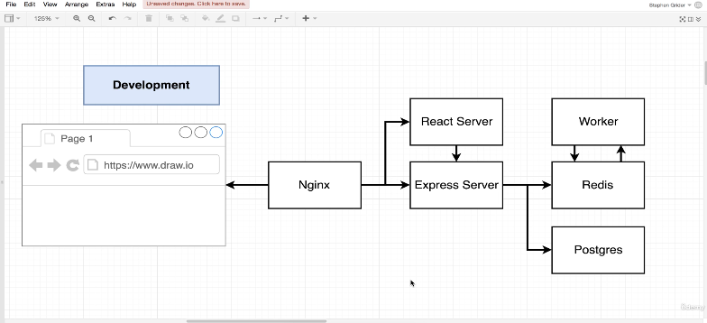
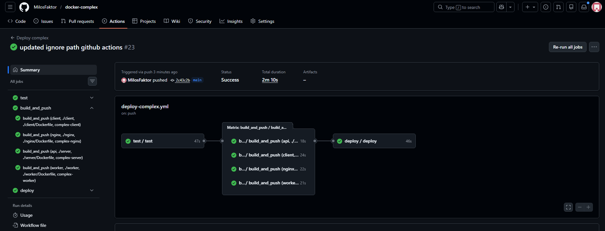
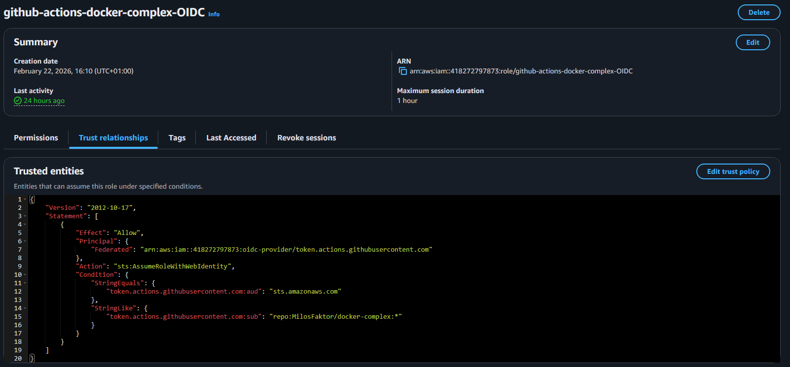
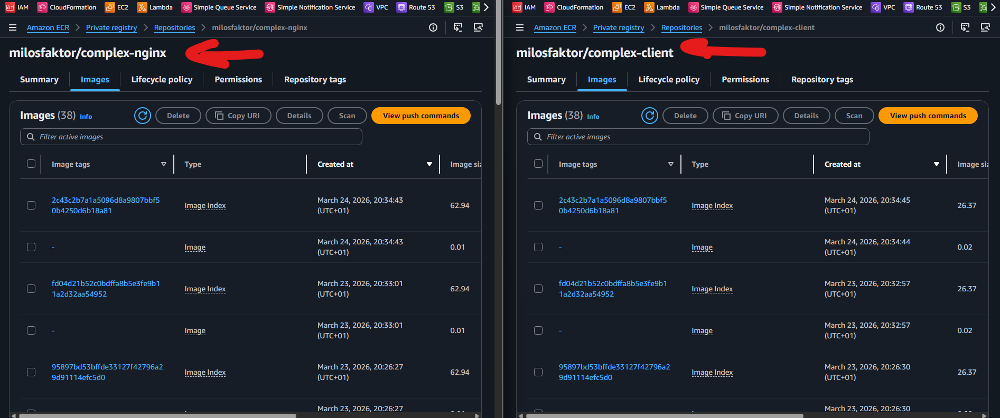
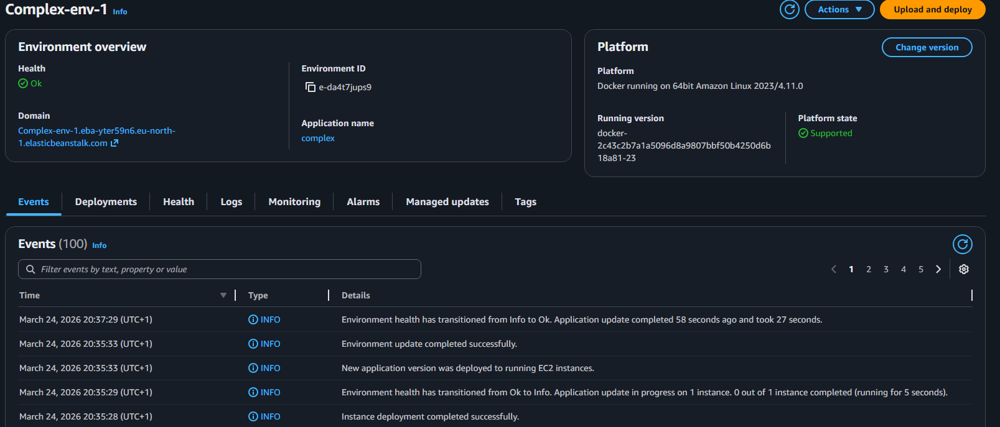
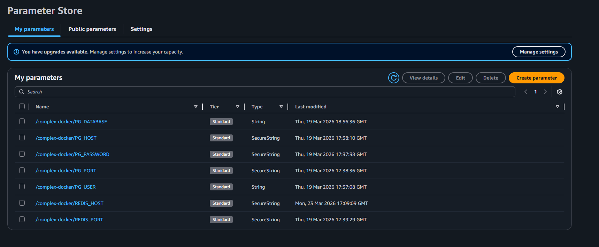
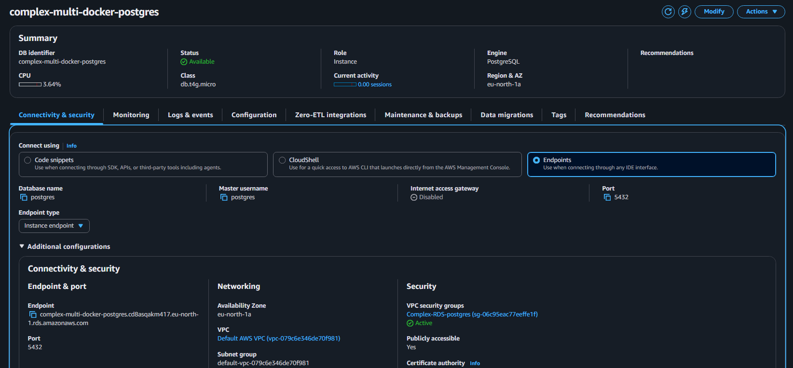
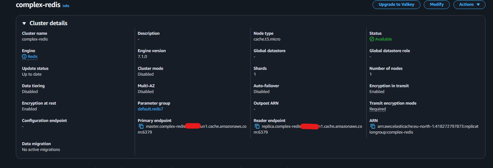

# Multi-Container Docker Application with AWS Deployment

This project demonstrates a multi-container Docker application deployed to AWS Elastic Beanstalk using Docker Compose.

The core application comes from a Docker course example, but the CI/CD pipeline, AWS integration, and security configuration were redesigned to work with modern AWS services and GitHub Actions.

The main focus of this project is working with **multi-container Docker applications**, while extending the deployment to real cloud infrastructure.

---

## Goal

The goal of this project was to practice:

- Multi-container Docker architecture
- Docker Compose in production
- CI/CD pipelines with GitHub Actions
- Deploying containers to AWS Elastic Beanstalk
- Using managed AWS services (RDS, ElastiCache)
- Secure configuration using AWS Parameter Store
- Image registry workflow with Amazon ECR
- OIDC authentication instead of IAM access keys

---

## Deployment Proof (Screenshots)

0. Diagram

1. Application running on AWS Elastic Beanstalk (React + API + Worker + Redis + Postgres)

2. Successful GitHub Actions workflow (matrix build, cache, push, deploy)

3. GitHub Actions → AWS authentication using OIDC IAM Role

4. Docker images stored in Amazon ECR with commit SHA tags

5. Elastic Beanstalk environment running Docker Compose deployment

6. AWS Parameter Store used for environment variables (SecureString)

7. RDS PostgreSQL instance used instead of container database

8. ElastiCache Redis instance with TLS enabled

---

## Application Architecture

Docker containers:

- React client
- Nginx reverse proxy
- Express API server
- Worker service

External services:

- Amazon RDS PostgreSQL (persistent storage)
- Amazon ElastiCache Redis (cache / pub-sub)

Flow:

1. User submits number
2. API stores index in PostgreSQL (RDS)
3. Worker listens for new values via Redis (ElastiCache)
4. Worker calculates Fibonacci value
5. Result stored in Redis
6. Client reads values through API

---

## Deployment Architecture

The application runs as a **multi-container Docker Compose environment** on AWS Elastic Beanstalk.

Additional improvements added:

- Docker images built in GitHub Actions
- Images pushed to Amazon ECR
- Image tags based on commit SHA
- Deployment bundle generated automatically
- Elastic Beanstalk pulls images from ECR
- External database and cache used instead of containers

---

## CI/CD Pipeline

GitHub Actions workflow:

1. Run tests
2. Build Docker images (client, nginx, server, worker)
3. Build images in parallel using matrix strategy
4. Use Docker layer caching to reduce build time
5. Tag images using commit SHA
6. Push images to Amazon ECR
7. Generate deployment bundle
8. Deploy to Elastic Beanstalk

Pipeline features:

- Matrix builds for parallel image build & push
- Docker layer caching for faster runtime
- OIDC authentication to AWS (no IAM keys stored in GitHub)
- Commit SHA image tagging for immutable deployments

---

## Configuration & Secrets

- Environment variables stored in AWS Parameter Store
- Retrieved by Elastic Beanstalk
- Passed to containers at runtime

Parameter Store was used instead of Secrets Manager because:

- secret rotation not required
- lower cost
- simple configuration

---

## AWS Services Used

- Elastic Beanstalk (multi-container Docker)
- Amazon ECR
- Amazon RDS PostgreSQL
- Amazon ElastiCache Redis
- AWS Parameter Store
- IAM with OIDC federation
- Security Groups

---

## Issues Solved

During deployment several problems had to be fixed:

- Redis required TLS connection in ElastiCache
- PostgreSQL required SSL connection in RDS
- Travis CI → GitHub Actions migration
- Old Redis client code updated for newer version
- Docker Compose deployment bundle generation fixed
- Environment variable injection fixed for Elastic Beanstalk

---

## Notes

The application logic comes from a Docker course example,  
but the CI/CD pipeline, AWS integration, and security configuration were implemented manually.

The main purpose of this project was to practice real-world Docker deployment with modern AWS tooling.
